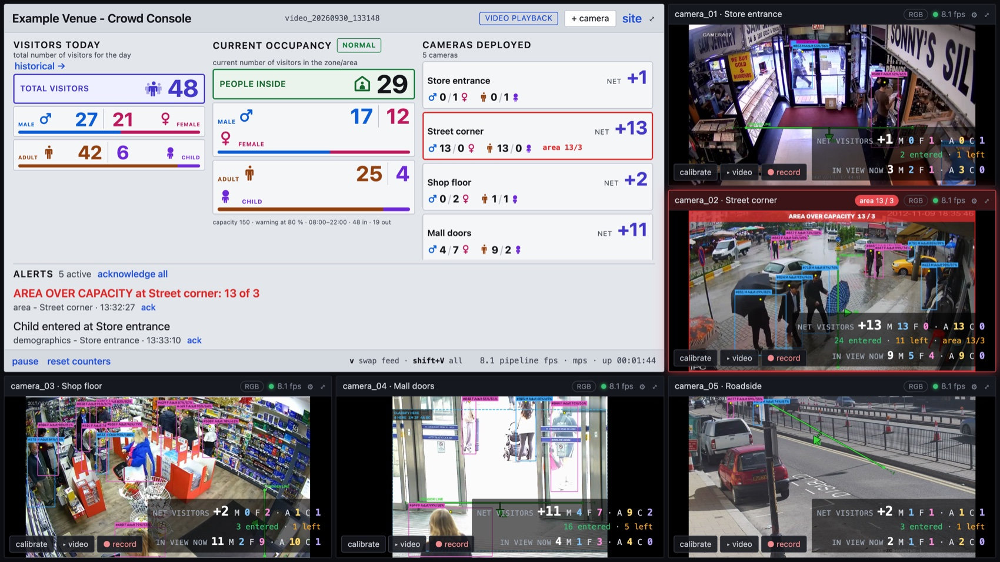
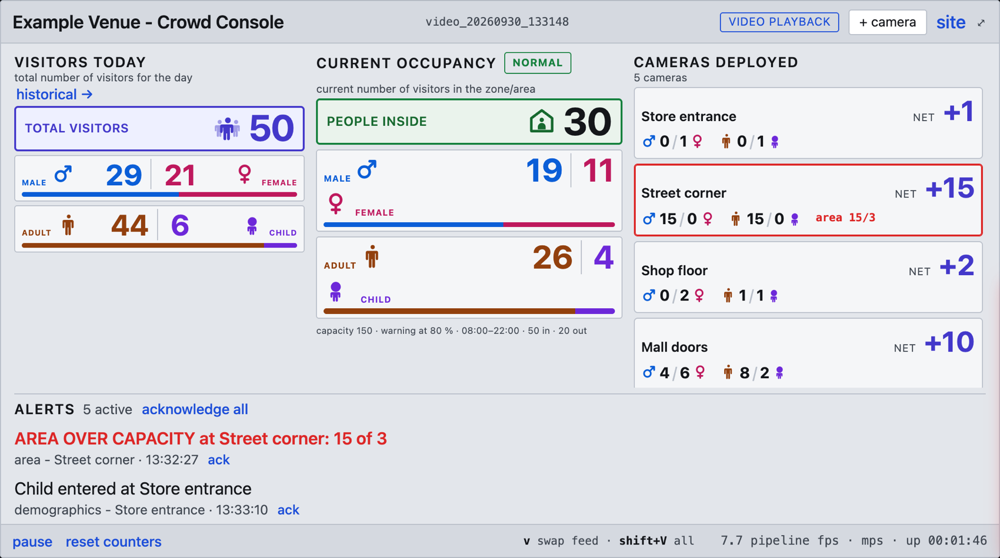
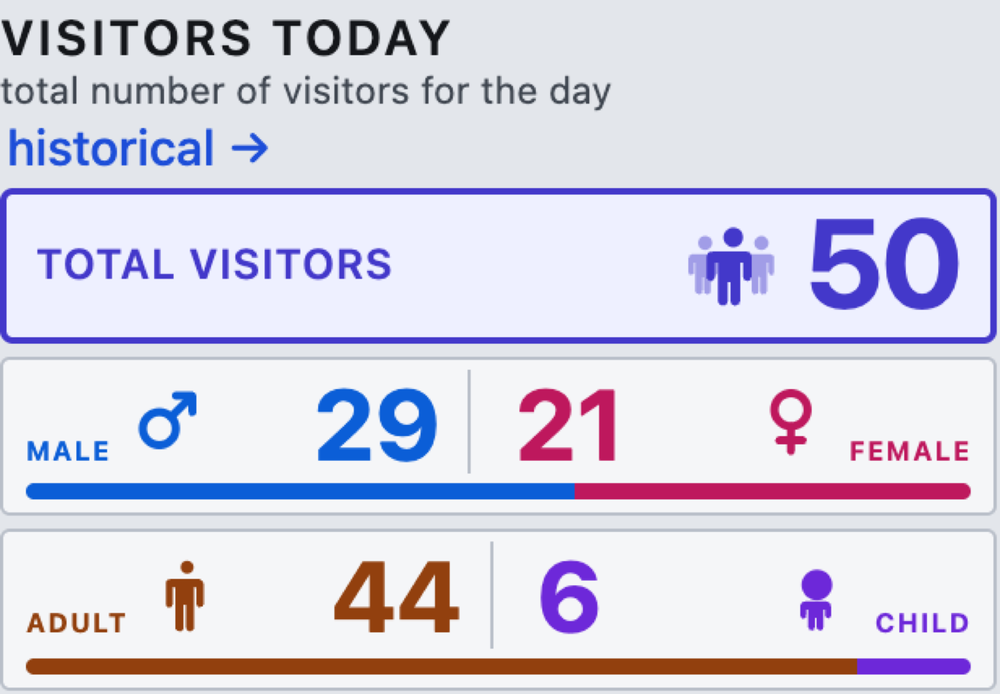
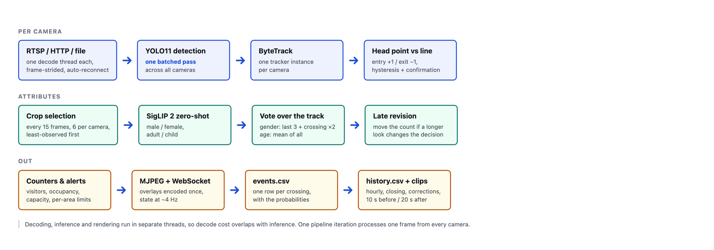
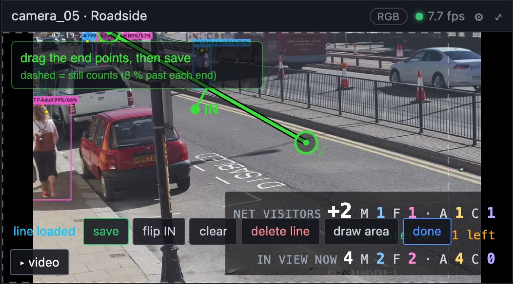
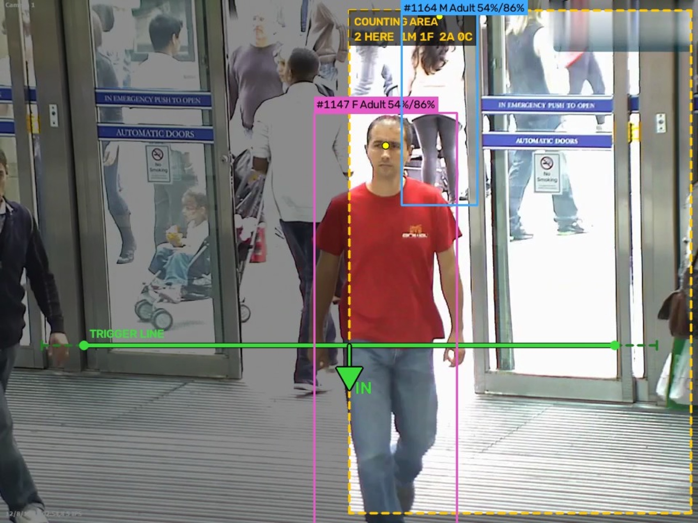
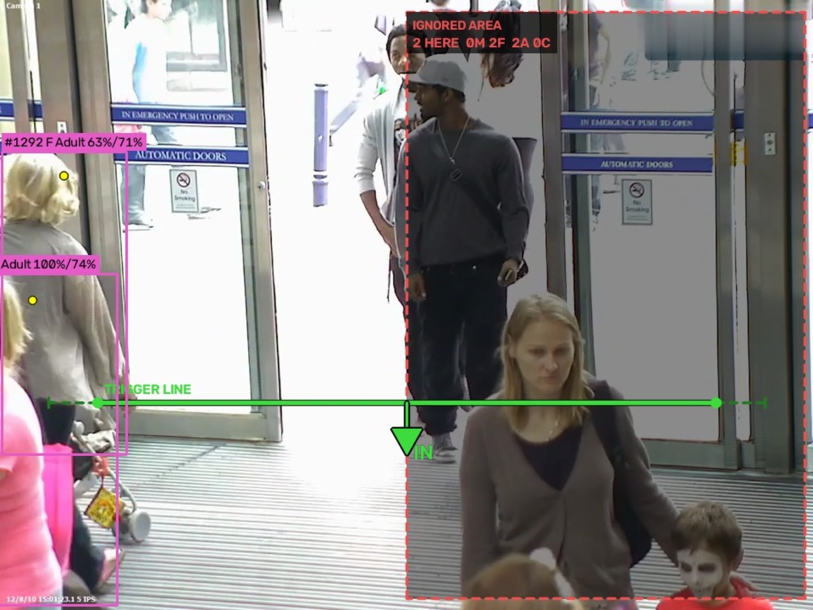
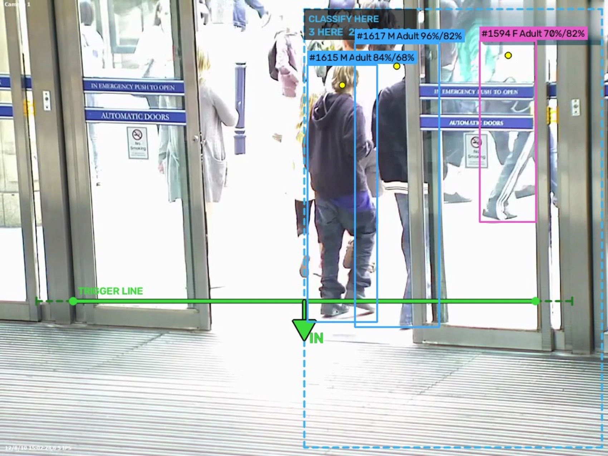
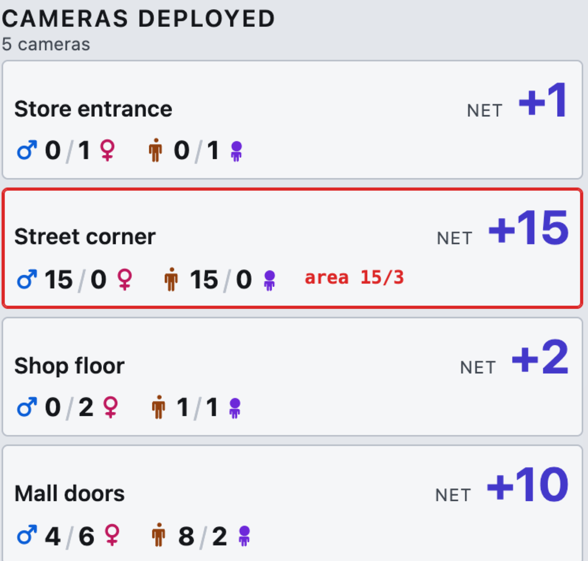
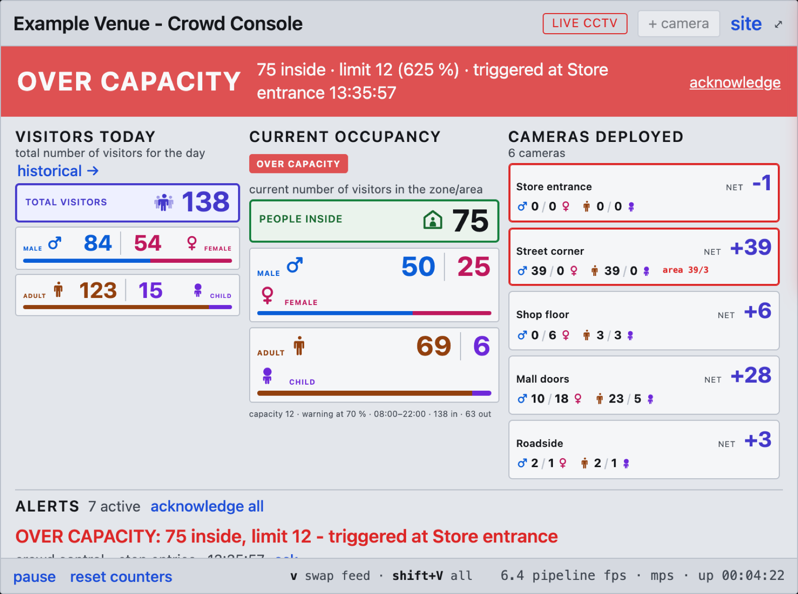

# Visitor counting on the CCTV a venue already has

{width=88%}

Five entrances, one site. No turnstile, no new hardware, no app.

# What the operator sees

{width=92%}

Visitors today, current occupancy and every camera, side by side.

# Two figures, deliberately different

{width=62%}

- **Visitors today** counts entries only and never falls
- **Current occupancy** is net, and falls again when people leave

Someone who walks in and out has still visited. Conflating the two is the most
common way a footfall dashboard misleads.

# How it works

{width=100%}

# A trigger line, and what it really covers

{width=72%}

The dashed extension past each end is the **8 % that still counts**. It is drawn,
because an invisible tolerance is indistinguishable from a bug when the numbers
look wrong. A line saved within 4 % of the frame edge warns.

# Demographics: two attributes, two strategies

- **Gender** — the last three looks plus one at the moment of crossing, counted
  double. The read swings early in a track and settles at the line.
- **Age** — averages every observation. "Child" is noisy per frame and smooths out.

Measured on 56 hand-labelled crossings:

| attribute | averaging everything | split strategy |
| --- | --- | --- |
| gender | 90.9 % | **94.5 %** |
| adult / child | 96.4 % | **100 %** |

Undecided people are reported as **unknown**, never guessed, so the splits
always reconcile to the total.

# Counting areas have a role: count only inside

{width=66%}

Only people inside the box are tracked at all — outside is dimmed, and the
people there carry no boxes. The area reports its own population: `2 HERE
1M 1F 2A 0C`.

# Ignore inside

{width=66%}

The mirror image: people inside the box are skipped entirely. For a window, a
mirror, a poster or a screen that the detector would otherwise count.

# Classify only inside

{width=66%}

Everyone is still counted; only those inside are sexed and aged. The accuracy
lever on a wide scene — spend the crop budget where people are large and clear,
instead of on distant figures.

# Why the role matters

Restricting what is **tracked** and restricting what is **classified** are
different needs.

| role | tracking | classifying | line may sit outside? |
| --- | --- | --- | --- |
| count only inside | inside only | inside only | **no** — saving warns |
| ignore inside | outside only | everyone tracked | yes |
| classify only inside | everyone | inside only | yes |

*Count only inside* must contain the whole trigger line: a person is only
tracked once inside the box, so one approaching from outside is first seen
already at the line. The console says so rather than quietly counting nothing.

# Cameras

{width=52%}

- Up to **six**, added and removed while running
- One row per camera, whatever the count; the list scrolls on its own
- Paired feeds: one key swaps a panel between its live camera and a saved clip
- An offline camera **hides its figures** rather than showing frozen ones

# Capacity, alerts, evidence

{width=88%}

The banner names the entrance that tipped the count, a clip is recorded
automatically, and any entrance can carry its own limit.

# Interfaces and data

- **24 HTTP and WebSocket endpoints** — state, history, cameras, lines, areas,
  capacity, recording
- **MJPEG** overlay stream per camera, encoded once and shared between viewers
- **JSON state** pushed over WebSocket at about 4 Hz

`events.csv` — one row per crossing, with the probabilities and observation
count behind the decision, so any number can be audited back to the frames that
produced it.

`history.csv` — hourly rows, closing totals, corrections, recorded events.

# Configuration stays on the machine

Three JSON files, written by the application, excluded from source control,
seeded from committed templates:

- `sources.json` — the live and video source sets
- `lines.json` — trigger lines and counting areas, in normalised coordinates
- `site.json` — hours, capacity, thresholds

A source update can never collide with a machine's own calibration, and camera
credentials never reach the repository.

# Platforms and performance

| platform | acceleration |
| --- | --- |
| Ubuntu 22.04 / 24.04 | NVIDIA CUDA |
| Windows 10 / 11 | NVIDIA CUDA |
| macOS (Apple Silicon) | Apple MPS |
| Ubuntu + Docker | NVIDIA CUDA |

RTX 3060 Ti, three 1080p streams: detection and tracking ~40 ms per iteration,
classification ~10–25 ms, **~11–14 iterations per second**. Throughput divides
across cameras.

# Known limits

- **Counting is the robust part.** It needs the camera to see heads cleanly
  across the line — overhead or high-angle works best, along a corridor is much
  harder.
- **Zero-shot classification is a baseline**, not a purpose-trained attribute
  model, and will not match one.
- **Distant people are counted but not classified**, and are reported as unknown.
- **The detector is AGPL-3.0.** Offering this as a network service may oblige
  disclosure or a commercial licence. One file imports it.

# Summary

- Runs on existing CCTV, one machine, no cloud, no per-site training
- Two figures that mean different things, and are never conflated
- Accuracy work is **measured**, not asserted
- Unknowns are **reported**, not guessed
- Every number is auditable back to the frames that produced it
